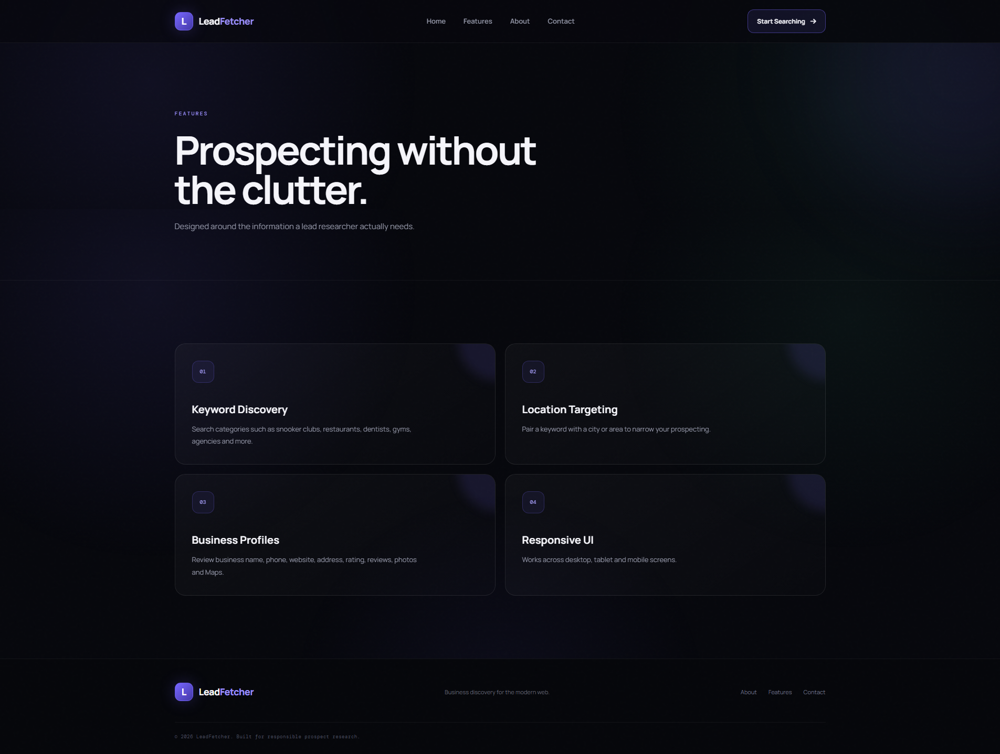
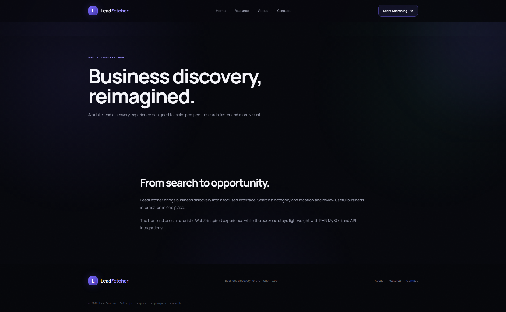
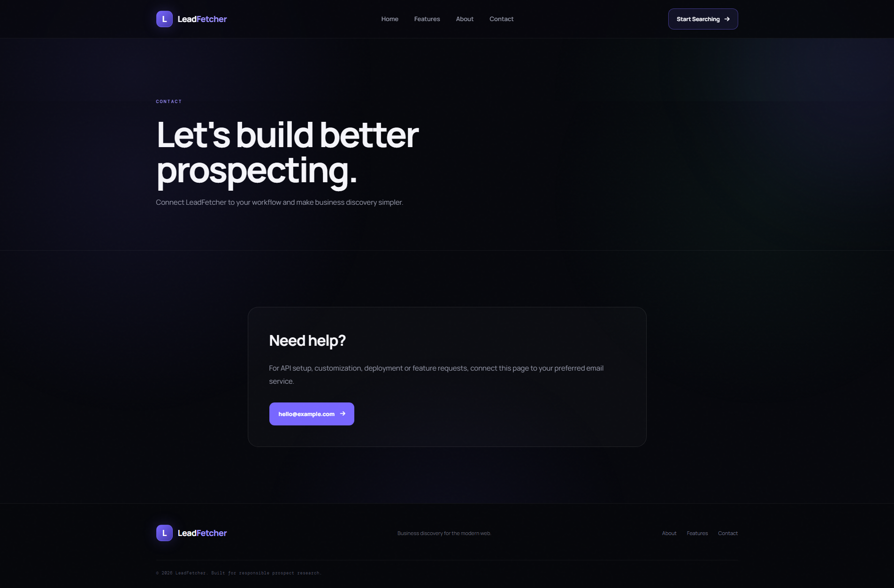
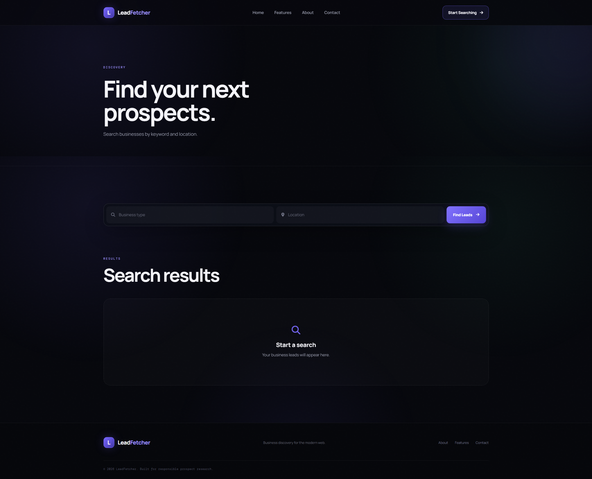

# LeadFetcher

A web-based lead generation and management tool designed to help users discover, search, and manage business leads efficiently.

## 📌 About The Project

**LeadFetcher** is a web-based lead generation platform built to provide an organized and user-friendly way to search for business leads.

The project focuses on creating a clean interface, structured lead information, and an efficient search experience.

## ✨ Features

* 🔎 Business lead search
* 📋 Lead information display
* 🏠 Modern home page
* 📱 Responsive design
* ⚡ Fast and interactive search experience
* 📄 Dedicated features section
* 👨‍💻 About section
* 📩 Contact section
* 🎨 Clean and user-friendly interface

## 🛠️ Technologies Used

* **PHP 8+**
* **MySQL**
* **MySQLi**
* **HTML5**
* **CSS3**
* **Bootstrap**
* **JavaScript**
* **AJAX / Fetch API**
* **Font Awesome**

## 📸 Screenshots

### 🏠 Home Page


### ✨ Features



### 👨‍💻 About



### 📩 Contact



### 🔎 Search



> Make sure the filenames above exactly match the files inside the `screenshots` folder.

## ⚙️ Installation

### 1. Clone the Repository

```bash
git clone https://github.com/YOUR-USERNAME/lead-fetcher.git
```

### 2. Move the Project

Move the project into your local server directory.

For WAMP:

```text
C:\wamp64\www\
```

For XAMPP:

```text
C:\xampp\htdocs\
```

### 3. Create the Database

Open **phpMyAdmin** and create a MySQL database.

```text
lead_fetcher
```

### 4. Import Database

Import the provided `database.sql` file into the database.

### 5. Configure Database

Update your database connection settings according to your local environment.

### 6. Run the Project

Start Apache and MySQL from WAMP/XAMPP.

Open:

```text
http://localhost/lead-fetcher/
```

## 📂 Project Structure

```text
lead-fetcher/
│
├── admin/
├── assets/
├── config/
├── includes/
├── screenshots/
│   ├── home.png
│   ├── features.png
│   ├── about.png
│   ├── contact.png
│   └── search.png
│
├── database.sql
├── index.php
└── ...
```

## 🎯 Project Purpose

LeadFetcher was developed as a practical web development project to demonstrate skills in:

* PHP development
* MySQL database integration
* Search functionality
* Frontend development
* Responsive web design
* JavaScript/AJAX
* Database-driven applications

## 🚀 Future Improvements

* Advanced lead filtering
* More detailed lead information
* Lead categories
* Export functionality
* Analytics and reporting
* API integrations
* Improved search capabilities

## 👨‍💻 Developer

**Shehryar Siddiqui**

Full Stack Web Developer | PHP Developer | Shopify Developer

---

⭐ If you find this project useful, consider giving it a star.
